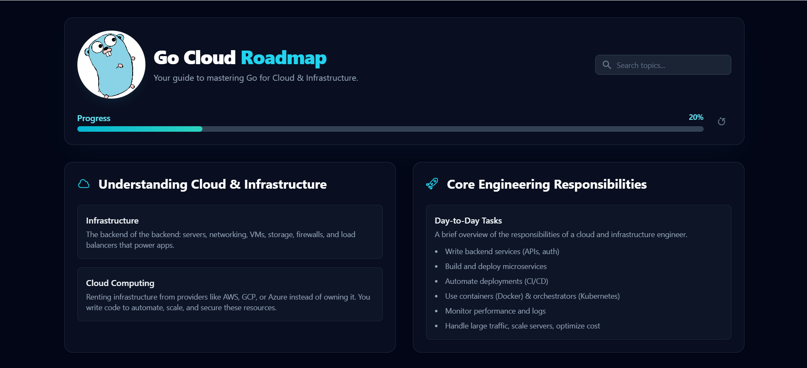
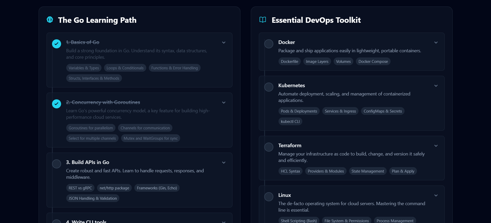
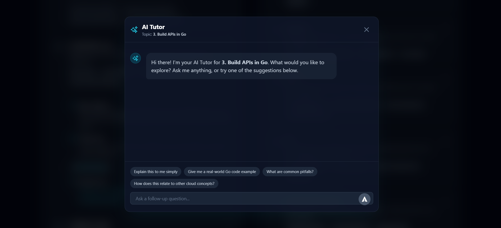

# Go Cloud Roadmap - Interactive Learning Guide





Welcome to the **Go Cloud Roadmap**, an interactive, step-by-step guide designed to help developers master Go (Golang) for Cloud and Infrastructure engineering. This web application provides a structured learning path, progress tracking, and an integrated AI tutor to make learning more effective and engaging.

**Live Demo:** [Experience the interactive roadmap here!](https://gocloudroadmap.netlify.app/)

---

## ✨ Features

- **Interactive & Structured Roadmap**: A comprehensive curriculum covering everything from Go basics and concurrency to essential DevOps tools like Docker, Kubernetes, Terraform, and Prometheus.
- **Progress Tracking**: Mark topics as complete and visually track your overall progress with a satisfying progress bar. Your progress is automatically saved to your browser's local storage.
- **AI-Powered Tutor**: Stuck on a concept? Each topic has an "Ask AI Tutor" button that opens an interactive chat session powered by the Google Gemini API. Get explanations, code examples, and answers to your questions in real-time.
- **Live Search**: Instantly filter the entire roadmap by keywords to quickly find the topics you're looking for.
- **Rewarding User Experience**: Celebrate your achievements with a burst of confetti every time you complete a topic.
- **Detailed Information**: Each item expands to reveal why it's important, a practical project idea, and links to high-quality external resources.
- **Fully Responsive**: A clean, modern, and fully responsive design that works beautifully on desktop, tablet, and mobile devices.
- **Reset Progress**: Want to start over? A confirmation-protected "Reset" button lets you clear your progress and begin your journey anew.

## 🛠️ Tech Stack

This project is built with a modern frontend stack, emphasizing performance, clean code, and a great developer experience.

- **Frontend**: [React](https://react.dev/) with [TypeScript](https://www.typescriptlang.org/)
- **Styling**: [Tailwind CSS](https://tailwindcss.com/)
- **Animations**: [Framer Motion](https://www.framer.com/motion/)
- **AI Integration**: [Google Gemini API](https://ai.google.dev/) (`@google/genai`)
- **Markdown Parsing**: [Marked](https://marked.js.org/)
- **Syntax Highlighting**: [highlight.js](https://highlightjs.org/)
- **Fun**: [canvas-confetti](https://github.com/catdad/canvas-confetti)

The application is architected as a single-page application with no build step, using modern ES Modules (`importmap`) for fast, on-the-fly dependency management.

## 🚀 Getting Started

To run this project locally, you'll need a modern web browser and a Google Gemini API key.

### Prerequisites

- A Google Gemini API Key. You can get one from [Google AI Studio](https://aistudio.google.com/app/apikey).
- A local web server to serve the `index.html` file. VS Code's [Live Server](https://marketplace.visualstudio.com/items?itemName=ritwickdey.LiveServer) extension is a great option.

### Installation & Setup

1.  **Clone the repository:**

    ```bash
    git clone https://github.com/aminshahid573/go-cloud-roadmap.git
    cd go-cloud-roadmap
    ```

2.  **Set up your API Key:**
    This project expects the API key to be available as an environment variable. Since this is a client-side application, you'll need to create a `process.env.js` file to simulate this.

    Create a new file named `process.env.js` in the root of the project and add the following content, replacing `YOUR_API_KEY_HERE` with your actual Gemini API key:

    ```javascript
    window.process = {
      env: {
        API_KEY: "YOUR_API_KEY_HERE",
      },
    };
    ```

3.  **Include the environment file in `index.html`:**
    Open `index.html` and add this script tag inside the `<head>` section, _before_ the `importmap` script:

    ```html
    <script src="process.env.js"></script>
    ```

4.  **Run the application:**
    Open the `index.html` file using a local web server (like the VS Code Live Server extension). This is necessary to handle the ES module imports correctly.

## ✍️ Author

This project was created and is maintained by **Shahid Amin**.

- **GitHub**: [@aminshahid573](https://github.com/aminshahid573)

---

## 📄 License

This project is licensed under the MIT License. See the `LICENSE` file for details.
